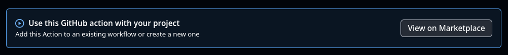
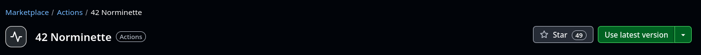

# Automating Norminette Checks with GitHub Actions

This guide explains how to set up a GitHub Action to automatically check your code against the 42 Norminette standard every time you push code or create a pull request. This helps ensure your code meets the required formatting standards consistently and catches errors early.

## Why Use This?

*   **Automation:** No need to manually run `norminette` locally before every push.
*   **Consistency:** Ensures all code in the repository follows the norm.
*   **Early Feedback:** See Norminette errors directly in GitHub shortly after pushing.
*   **Collaboration:** Makes it easy for collaborators (and evaluators) to see if the code is norm-compliant.

## Finding the Action on GitHub Marketplace

The core of this setup relies on a pre-built action available on the GitHub Marketplace.

1.  You can find the specific action here: [alexandregv/norminette-action](https://github.com/marketplace/actions/42-norminette)
     <!-- Assuming image.png is the "View on Marketplace" button -->

2.  The Marketplace page provides installation instructions. Look for the "Use latest version" button or similar sections for the code snippet.
     <!-- Assuming image-1.png is the "Use latest version" button -->

3.  The Marketplace will typically give you a snippet like this (potentially with the very latest specific version number):

    ```yaml
    # Installation snippet from GitHub Marketplace

    - name: 42 Norminette
      uses: alexandregv/norminette-action@v3.3.53
      # Note: The version (@v3.3.53) might differ slightly.
      # Using @v3 is also common to get the latest v3 release.
    ```

    This snippet forms the core part of Step 3 below.


## Setup Steps

1.  **Create the Directory Structure:**
In the root of your Git repository, create a `.github` directory if it doesn't exist. Inside `.github`, create a `workflows` directory.
Your structure should look like this:

	```
	your-project-root/
	├── .github/
	│   └── workflows/
	├── src/
	├── includes/
	└── ... other files ...
	```

2.  **Create the Workflow File:**
Inside the `.github/workflows/` directory, create a new file named `norminette_check.yml` (or any other `.yml` name you prefer, like `main.yml`).

3.  **Add the Workflow Content:**
    Paste the following code into the `norminette_check.yml` file. Notice how the `- uses: alexandregv/norminette-action@...` line comes directly from the Marketplace snippet shown above.

    ```yaml
    # .github/workflows/norminette_check.yml

    name: Norminette Check # Name displayed in the GitHub Actions tab

    # Events that trigger this workflow
    on: [push, pull_request] # Run on pushes and pull requests to any branch

    jobs:
      norminette_check: # The ID of the job
        name: Run Norminette Linter # Name displayed for this specific job
        runs-on: ubuntu-latest    # Use the standard GitHub-hosted Ubuntu runner

        steps:
          # Step 1: Check out your repository code onto the runner
          # This is essential so the action can access your files.
          - name: Checkout code
            uses: actions/checkout@v4 # Use the latest official checkout action

          # Step 2: Run the Norminette action (using the Marketplace snippet)
          # Replace the version if needed, or use @v3 for the latest v3.x.y
          - name: 42 Norminette
            uses: alexandregv/norminette-action@v3.3.53 # <-- From Marketplace
            with:
              # Input for the action: specify flags/paths for norminette
              # Default is '.', checking all files from the repository root.
              flags: '.'
              # Example: If your code is only in 'src' and 'includes' directories:
              # flags: './src ./includes'
    ```

4.  **Commit and Push:**
    Add the `.github/workflows/norminette_check.yml` file to Git, commit it, and push it to your GitHub repository.
    ```bash
    git add .github/workflows/norminette_check.yml
    git commit -m "chore(ci): Add Norminette GitHub Action workflow"
    git push origin your-branch-name
    ```

## How It Works

1.  **Trigger:** When you `git push` or create/update a Pull Request, GitHub detects the workflow file.
2.  **Runner Starts:** GitHub launches a virtual machine (an `ubuntu-latest` runner).
3.  **Checkout:** The `actions/checkout@v4` step downloads your repository's code onto the runner.
4.  **Norminette Action:** The `alexandregv/norminette-action@v3` step runs. This action typically uses a pre-built Docker container that already has `norminette` installed.
5.  **Execution:** Inside the container, the `norminette` command is executed with the flags you specified (defaulting to `.`). It checks the code downloaded in the checkout step.
6.  **Report Status:** The action reports back to GitHub whether `norminette` passed (exit code 0) or failed (non-zero exit code).

## Checking the Results

*   **Actions Tab:** Go to the "Actions" tab in your GitHub repository. You'll see a list of workflow runs.
*   **Status Indicators:**
    *   A **green checkmark (✅)** next to a commit or pull request means the Norminette check passed.
    *   A **red cross (❌)** means the Norminette check failed.
    *   A **yellow circle (🟡)** means the check is currently running.
*   **Viewing Errors:** If a check fails (❌), click on the failed run in the "Actions" tab, click the job name (e.g., "Run Norminette Linter"), and then expand the "Run norminette check" step. The logs will show the exact output from `norminette`, including the file names, line numbers, and error types.

## Customization

*   **Specific Paths:** If you only want to check specific directories (like `src` and `includes`), modify the `flags` input in the workflow file:
    ```yaml
          with:
            flags: './src ./includes'
    ```
*   **Specific Version:** If your campus requires an exact Norminette version (e.g., `v3.3.51`), you can specify it in the `uses:` line:
    ```yaml
          uses: alexandregv/norminette-action@v3.3.51
    ```


## References

*   [GitHub Repository: norminette-action@v3](https://github.com/alexandregv/norminette-action?tab=readme-ov-file)
*   [Youtube: How GitHub Actions 10x my productivity - Beyond Fireship](https://www.youtube.com/watch?v=yfBtjLxn_6k) (General GitHub Actions productivity tips)

---
This guide should provide a clear path for setting up the automated Norminette checks in your 42 projects.